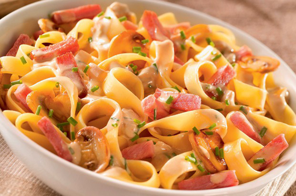
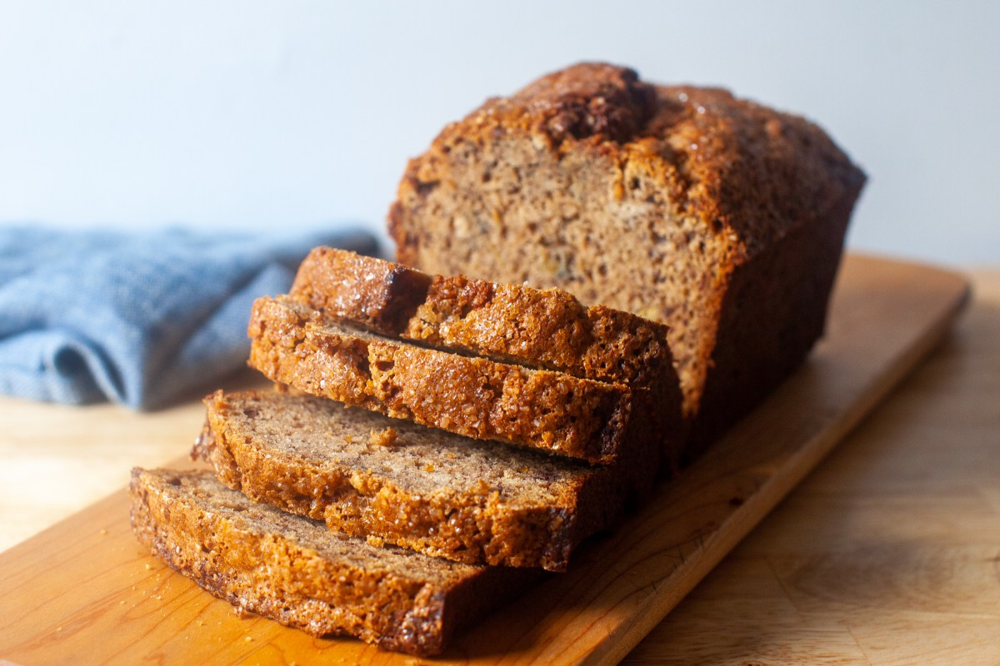

Landing Page Project

Charlotte's Delight

Charlotte's Delight is a landing blog page. The project help us to make a good landing page with a dynamic navigation and active classes.

Usage 

- Home
- About
- Recipes 
- Foodstylism
- Contact

# Charlotte's Delight
## About

Hi, my name is Charlotte and I've always been passionate about cooking, so I decided to create this blog to share recipes. With time, I developed a passion for culinary styling that made me want to share it with you.

## Recipes

### Pumpkin soup

### Avocado toast

### Risotto

## Foodstylism

## Contact

Contact form

Contributing

We encourage you to contribute to Charlotte's Delight! 